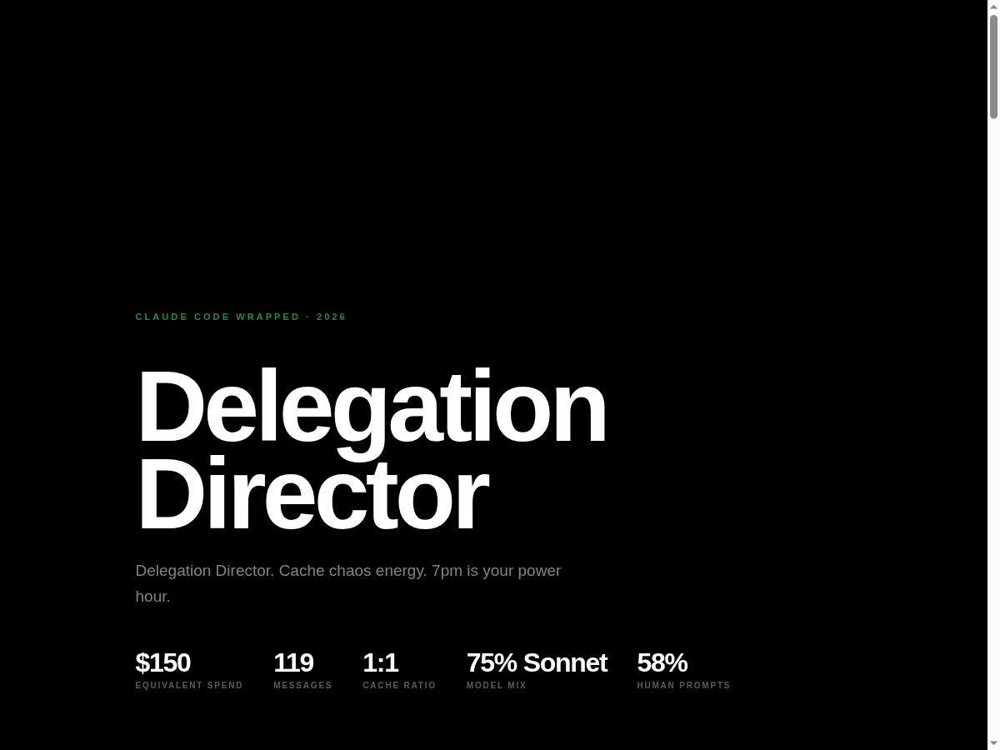
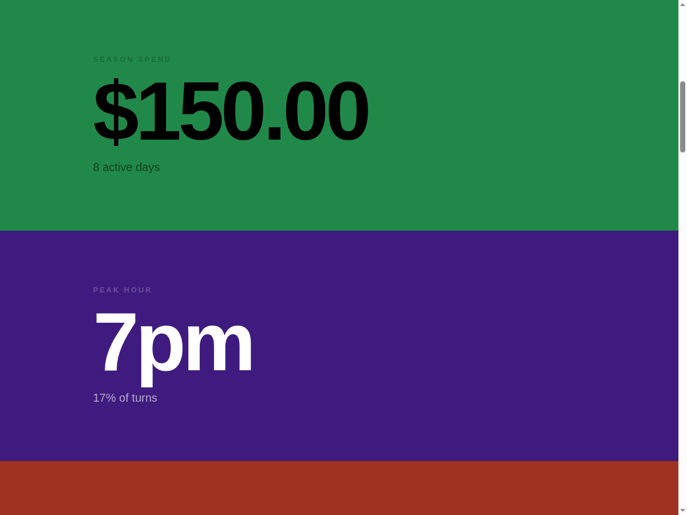
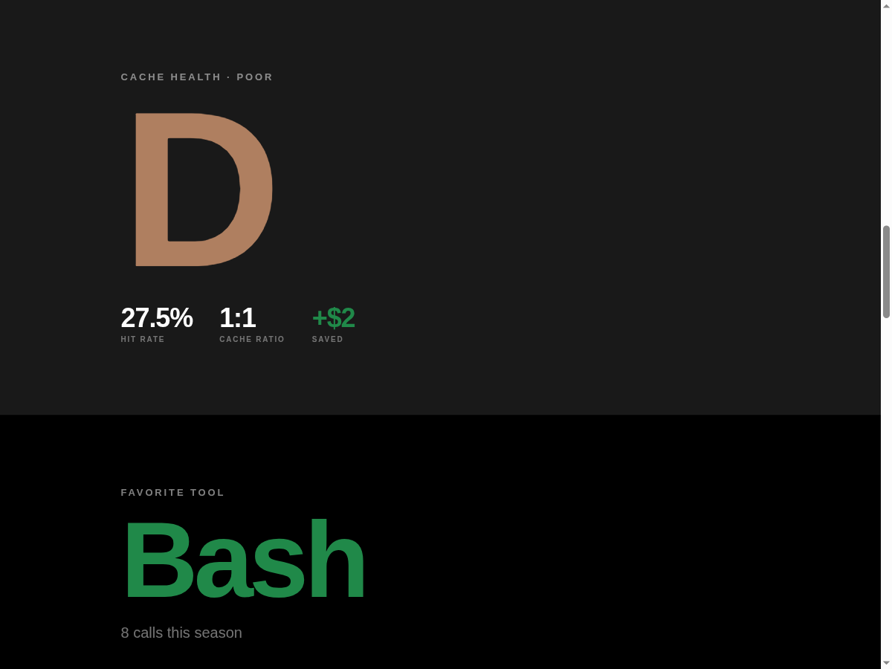
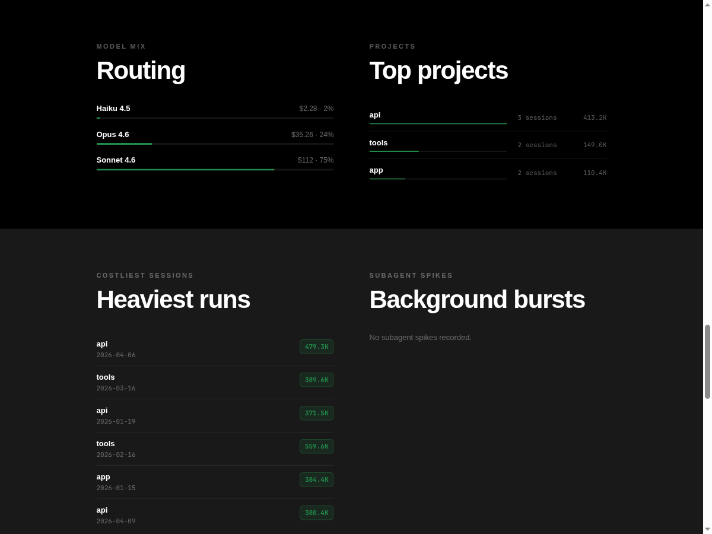
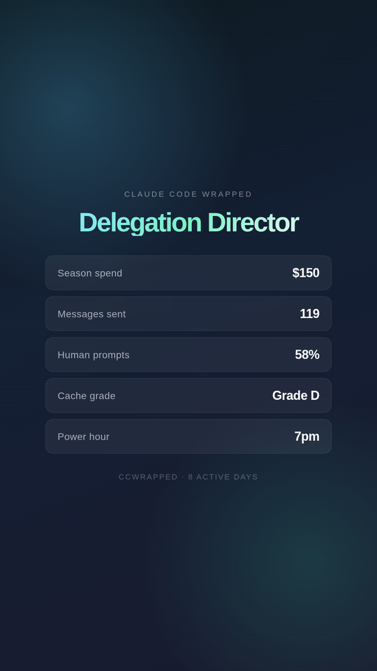

# claude-code-wrapped

Your Claude Code year in review. Same idea as Spotify Wrapped, except for your dev sessions with Claude.

I built this because I couldn't answer basic questions about my own usage. How much have I spent? Is my caching actually doing anything? Am I reaching for Opus when Haiku would do just fine? The Claude dashboard has token counts and a cost total - that's it. I wanted something that reads the data and tells me what it means.

It reads `~/.claude/projects/**/*.jsonl` directly - nothing leaves your machine - and writes a terminal recap, an HTML report, a shareable card, and an optional per-project prompt archive.

<p align="center">
  
</p>

<p align="center">
  
  
</p>

<p align="center">
  
</p>

The `--card` flag generates a shareable story card (no project names, no paths):

<p align="center">
  
</p>

| I want to... | Go to |
|---|---|
| Install and run it | [Quick start](#quick-start) |
| See all flags | [Flags](#flags) |
| Understand what it computes | [What it measures](#what-it-measures) |
| Contribute or hack on it | [Development](#development) |

## Quick start

```bash
cargo install --git https://github.com/onblueroses/claude-code-wrapped
ccwrapped
```

That's it. It finds your Claude Code history automatically at `~/.claude/projects/`.

## Flags

```bash
ccwrapped [YEAR]               # default: current year
ccwrapped --markdown           # also write claude-code-wrapped.md
ccwrapped --card               # write + open a shareable animated HTML card
ccwrapped --archive            # write per-project prompt files to ./wrapped-archive/ (contains prompt excerpts — don't share)
ccwrapped --no-open            # skip auto-opening browser
ccwrapped --json               # print raw JSON to stdout, no files written
```

The `--card` flag writes a 1080x1920 HTML file: CSS animations, no JavaScript, no project names or paths. It screenshots cleanly and shares without leaking anything about what you're working on.

## What it measures

**Cost** — total spend and per-model breakdown, using `costUSD` from your JSONL records directly (not estimated from tokens).

**Cache health** — hit rate, efficiency ratio, estimated savings, and an A–F grade. The grade factors in both your cache hit rate and how often your cache gets invalidated.

**Model routing** — distribution across Opus/Sonnet/Haiku and what it implies about your workflow. If you're running Opus on everything, it'll say so.

**Session shape** — busiest hour, favorite weekday, longest streak, burst vs. steady-tempo pattern. These feed into your archetype.

**Prompt ratio** — how many messages came from you vs. tool callbacks. A low human percentage usually means long agentic runs.

**Archetypes** — one of four patterns (Precision Maximalist, Delegation Director, Flow-State Builder, Balanced Operator) derived from your model mix and message cadence. A separate momentum card (Burst-mode Operator or Measured Tempo) captures your day-to-day pacing.

**Recommendations** — data-driven suggestions based on what the data actually shows: cache patterns, model routing, session structure.

## How it works

```
~/.claude/projects/**/*.jsonl
         │
         ▼
    readers/          parse JSONL, group by session, count prompts
         │
         ▼
    analyzers/        cost, cache grade, model routing, wrapped story
         │
         ▼
    renderers/        terminal, HTML, markdown, share card
         │
         ▼
    output files
```

## Privacy

Everything runs locally — no network calls, no telemetry.

The `--card` output is designed for sharing: it contains only aggregate stats, no project names or file paths. The `--archive` output contains prompt excerpts — don't share it.

The main HTML report includes project names and directory paths derived from your JSONL history. If you screenshot it, be aware those are visible. The terminal output and markdown output also include project names.

## Development

```bash
git clone https://github.com/onblueroses/claude-code-wrapped
cd claude-code-wrapped
cargo build --release
cargo test
./target/release/ccwrapped --no-open
```

See [CONTRIBUTING.md](CONTRIBUTING.md) for PR conventions.

## License

MIT — see [LICENSE](LICENSE).
