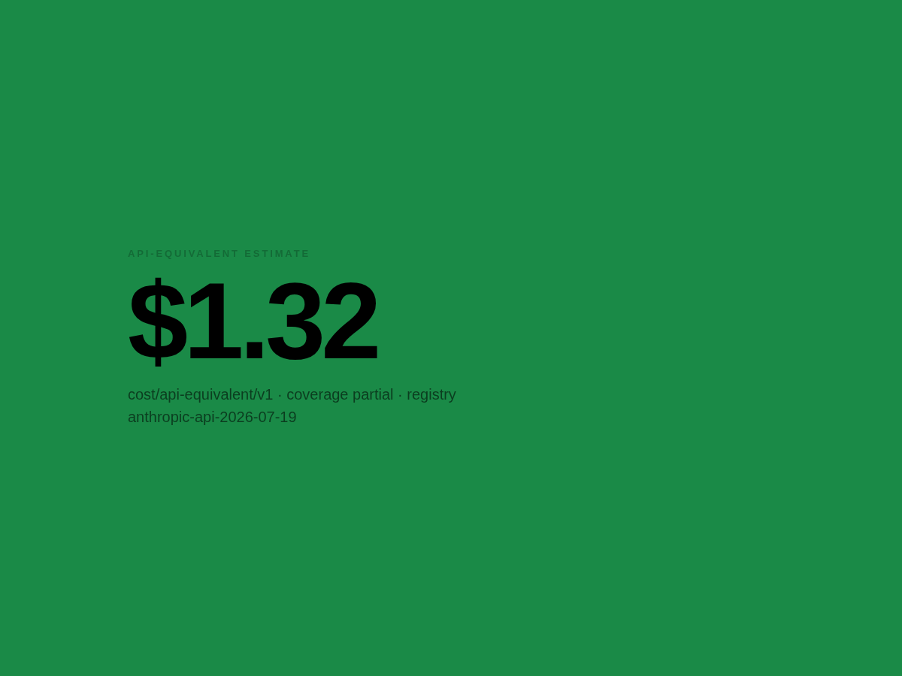
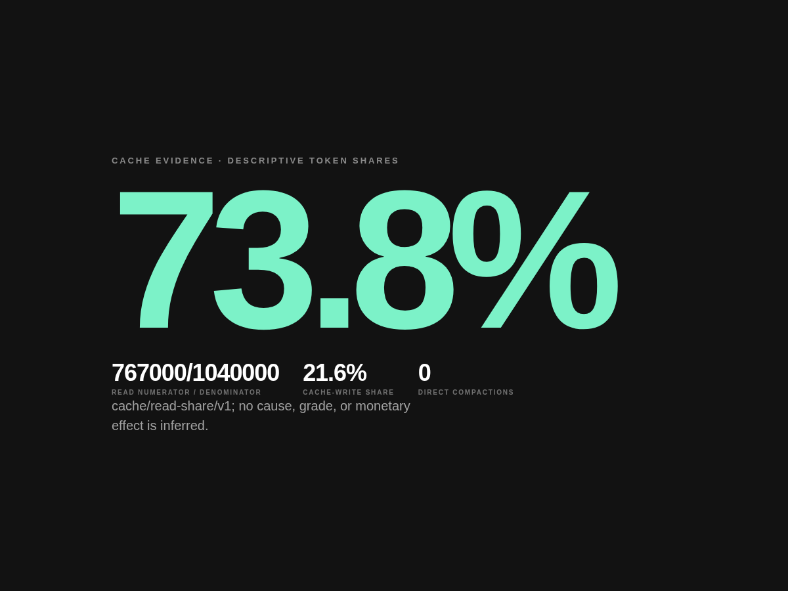
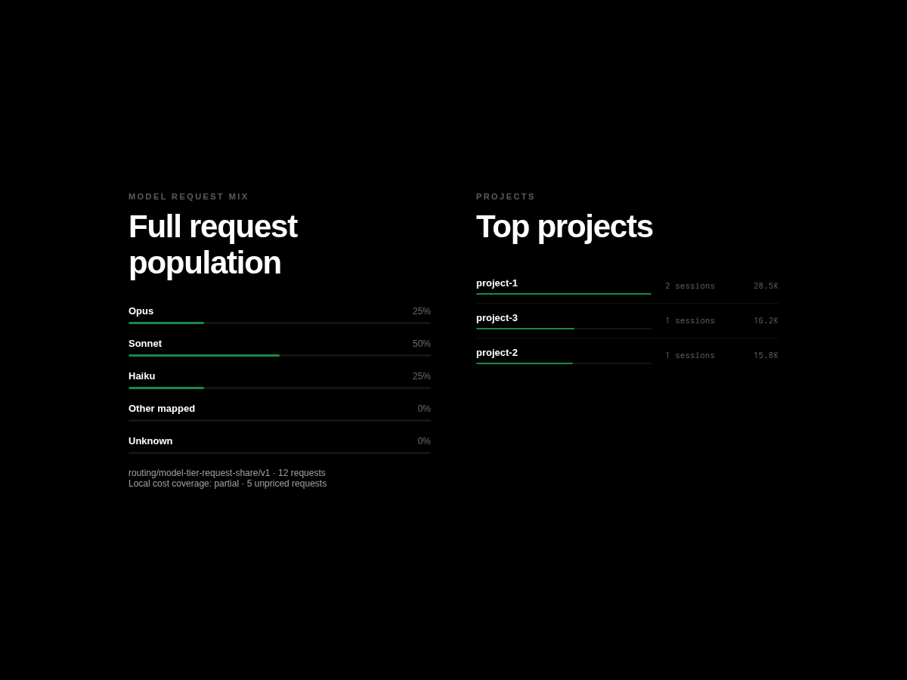
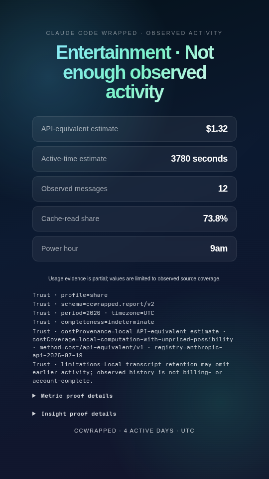

# claude-code-wrapped

An evidence-aware Wrapped view of the Claude Code activity your selected local artifacts
actually contain. Complete source snapshots keep the concise year treatment; retained or
otherwise uncertain history is labeled as observed activity.

I built this because I couldn't answer basic questions about my own usage. How much activity
did my retained local history observe? What share of input context came from cache reads?
Which exact models account for the locally modeled API-equivalent estimate? I wanted
something that reads the available data, explains its limits, and makes the result enjoyable.

It streams retained local Claude Code artifacts through a privacy-safe normalized pipeline.
Nothing leaves your machine. The default report excludes prompt/response content, canonical
paths, and raw session/account identifiers; an optional archive is the explicit
content-bearing output.

<p align="center">
  
</p>

<p align="center">
  
  
</p>

<p align="center">
  
</p>

The `--card` flag generates a shareable story card (no project names, no paths):

<p align="center">
  
</p>

| I want to... | Go to |
|---|---|
| Install and run it | [Quick start](#quick-start) |
| See all flags | [Flags](#flags) |
| Understand what it computes | [What it measures](#what-it-measures) |
| Contribute or hack on it | [Development](#development) |

## Quick start

```bash
cargo install --git https://github.com/onblueroses/claude-code-wrapped --locked
ccwrapped
```

That's it. With no source option, discovery uses CLAUDE_CONFIG_DIR/projects when that
variable is set, then the supported HOME/.claude/projects default. Use repeatable
--data-dir options to select one or more projects/config directories explicitly.
Release archives also include `SHA256SUMS` and GitHub build-provenance attestations for
offline checksum verification and origin verification.

## Flags

```bash
ccwrapped [YEAR]               # default: current year, terminal output only
ccwrapped --data-dir PATH      # explicit projects/config directory; repeatable
ccwrapped --otel-file PATH     # supported local Collector JSON/JSONL; repeatable and opt-in
ccwrapped --private-diagnostics # print exact selected paths to stderr
ccwrapped --html               # also write claude-code-wrapped.html
ccwrapped --card               # write a shareable 1080x1920 HTML card
ccwrapped --markdown           # write claude-code-wrapped.md
ccwrapped --all                # write all formats (html + card + markdown)
ccwrapped --open               # write/open HTML when needed; open selected HTML artifacts
ccwrapped --archive            # write per-project prompt files to ./wrapped-archive/ (contains prompt excerpts - don't share)
ccwrapped --json               # one JSON value; conflicts with file/open flags
ccwrapped --plain              # disable colors (also respects NO_COLOR env var)
ccwrapped --timezone Europe/Berlin # use one explicit IANA timezone for all calendar facts
ccwrapped --active-threshold-minutes 5 # cap inferred adjacent-event activity
ccwrapped --no-store           # fresh scan; do not read or write incremental state
ccwrapped --store-path PATH    # use an explicit local SQLite store
ccwrapped --rebuild-store      # replace derived store state from a complete source scan
```

By default, `ccwrapped` prints a report to your terminal and maintains a private local
incremental store at `$XDG_CACHE_HOME/ccwrapped/store-v1.sqlite3` when `XDG_CACHE_HOME` is
absolute, otherwise `$HOME/.cache/ccwrapped/store-v1.sqlite3`. Use `--no-store` for a
stateless fresh scan. The store contains only salted/privacy-safe derived facts, bounded
diagnostics, and compressed analysis/report caches; it never contains prompt or response
content. Use `--html`, `--card`, or `--all` to export files. Standalone `--open` writes the standard
HTML report and opens it; beside Markdown or archive it also supplies that browser-readable
HTML. Beside HTML, card, or all it opens exactly the selected HTML artifacts. Use `--plain`
when running in environments that don't render ANSI colors (e.g. piped output, Claude Code
bash tool).

`--json` is an exclusive machine-output mode. Combining it with `--html`, `--markdown`,
`--card`, `--archive`, `--all`, or `--open` returns one JSON
`E_CLI_ARGUMENT_INVALID` object on stdout, empty ordinary stderr, exit code 2, and no file
or browser side effect. Explicit `--private-diagnostics` may still add the separately
labeled private path stream to stderr.

Requested HTML, Markdown, card, and archive outputs publish as one normal-error transaction.
The complete set is rendered under a fresh protected staging directory, every destination is
validated before commit, and existing regular standard files are backed up until all requested
outputs commit. A later write, sync, or archive conflict restores each prior file while its
destination still belongs to this transaction and removes staging residue. If another process
replaces a standard destination, rollback leaves that competitor untouched, retains the prior
file in the named owner-only recovery staging directory, and returns an error for manual
reconciliation. A durable publication manifest lets the next invocation finish that rollback
after a process or machine crash. Standard output symlinks and non-regular destinations are refused; browser
opening and success messages occur only after commit. The command waits for the platform
launcher; if it cannot start or exits non-zero, every committed file remains, the command
reports `E_BROWSER_OPEN`, and it exits non-zero.

Every standard output uses run-local aliases such as project-1, session-1, and
transcript-1. `--private-diagnostics` is the only CLI surface that prints exact selected
source paths; it labels that stderr stream `private` and never adds those paths to report
JSON.

--otel-file accepts only the documented local, uncompressed Collector file-exporter
OTLP/JSON contract. It does not open a network receiver or accept console, Prometheus,
protobuf, compressed, trace, or profile formats. See
[docs/ingestion.md](docs/ingestion.md) for the exact contract and limits.

The `--card` flag writes a 1080x1920 HTML file: CSS animations, no JavaScript, no project
names or paths. Its template receives an aggregate-only typed DTO, labels itself `share`,
and never receives the full report. It screenshots cleanly and shares without exposing what
you're working on.

## What it measures

**Cost evidence** — source-recorded estimates, locally modeled API-equivalent estimates,
and billing-authoritative values remain separate. The embedded dated registry prices only
exact supported provider/model/effective-interval/cache-TTL combinations. Unknown or
partner-operated combinations stay unpriced and reduce the displayed coverage.

**Cache evidence** — cache-read share is `cache_read / (input + cache_read)`;
cache-write share is `cache_creation / (input + cache_creation)`. Zero or incomplete
denominators render as unavailable. Token counters do not create a cache grade, cause,
invalidation, or monetary effect.

**Active time** — elapsed session span stays separate from a capped, half-open active-time
estimate. The estimate clips to the selected year, splits at local-day boundaries, and
unions overlapping main-agent/subagent/direct-duration intervals.

**Explainable changes** — adjacent 28-day comparisons, median-halves trends, active-hour
rates, robust daily anomalies, and project concentration are emitted as typed proof cards.
Each card includes its method, window, samples, coverage, limitations, and supporting facts.

**Reliability and tools** — direct local OTel events can add terminal API outcomes,
recovered retries, tool-result rates and latency, and edit decisions. Transcript tool names
remain occurrence-only; missing direct telemetry stays unavailable rather than becoming 0%.
Direct latency accepts finite durations up to 24 hours, and tool recommendations evaluate all
classified tools before the ten-card presentation cap.

**Model routing** — exact mapped-model request, output-token, and local API-equivalent cost
shares, with unknown and unpriced coverage kept visible. Denominators include all mapped
models before display capping, with omitted mapped rows preserved as `other-mapped`. The report describes observed
concentration without inferring task intent, model quality, avoidable spend, or savings.
Routing advice additionally requires capability-complete canonical request evidence from a
non-transcript source; retained transcript history remains descriptive only.

**Measured local performance** — a pinned synthetic campaign selected the default SQLite
branch: about 15× faster warm decision-corpus reports, exact clean-scan equality, bounded
incremental work, and a stable 12-worker production point. These measurements describe the
exact binary named in the benchmark record; later correctness, privacy, and pricing changes
are not represented by that historical timing snapshot. Performance is informational rather
than a release gate. See the [Phase 5 benchmark record](docs/benchmarks/phase5.md) for
raw-evidence hashes, variance, RSS/store limits, and the scaling curve.

**Session shape** — busiest hour, favorite weekday, longest streak, and human-versus-tool
prompt counts remain descriptive views of the selected observations.

**Entertainment labels** — after at least 20 canonical request/message observations across
five active dates, a visibly marked label is selected deterministically: The Orchestrator,
The Toolsmith, The Specialist, or The Explorer. Sparse histories receive no persona.
Cache and momentum labels additionally require their own canonical cache or trend evidence.

**Recommendations** — emitted only when a rule has direct supporting evidence, a declared
baseline, sufficient samples, and a reversible action. Otherwise the report leaves the
recommendation surface empty.

Every stable insight ID also owns an exact program-authored title and finding template.
Production reconciliation derives their variable values from supporting facts and rejects
changed narratives, experiments, or ordered alternatives before any renderer can publish them.
Terminal, HTML, Markdown, and the privacy-filtered share proof ledger consume the same
canonical narrative lines.

## How it works

```
transcript roots          opt-in local Collector JSON/JSONL
       │                              │
       └──── versioned source adapters ────┘
                          │
              privacy-safe normalized events
                          │
           diagnostics + deterministic dedup
                          │
             canonical metrics + authority
                          │
          bounded typed insight proof engine
                          │
        versioned report shared by output formats
```

## Privacy

Everything runs locally. ccwrapped makes no outbound request and emits no telemetry.
--otel-file only reads a local artifact that you explicitly select.

Store directories created by ccwrapped use owner-only mode 0700 on Unix, while the database
and rollback journal use mode 0600; an existing Unix parent is preserved and must not be
group- or world-writable. Windows creates the store directory, database, journal, and lock
with a protected current-user ACL in the creation syscall, creates each missing parent the
same way, rejects reparse-point ancestors, and rejects any ancestor ACL that grants delete or
ACL-takeover rights to an untrusted principal or names an untrusted owner; an existing store
parent must already have exact current-user protection. Database, rollback journal, migrations, and rebuild all fail
closed when those protections cannot be enforced. A corrupt derived store produces an actionable `E_INCREMENTAL_STORE`
error; `--rebuild-store` builds a private sibling database and atomically publishes it only
after a complete, publishable scan, so a failed scan preserves the prior store and never
modifies source artifacts. Formats 1–8 migrate by building the current format in a private
sibling and replacing the legacy database only after a successful report; an interrupted
migration leaves the prior database byte-for-byte authoritative. A crash-releasing per-store
lock serializes preparation, publication, rebuild, and migration.

The default terminal, JSON, HTML, and Markdown outputs use the `standard` profile; the card
uses the narrower `share` profile. Both omit prompt/response content, canonical/relative
source paths, and raw identifiers. Project and session labels are
deterministic run-local aliases. Coverage reports malformed, unsupported, filtered,
redacted, duplicate, and skipped observations rather than silently dropping them.
Canonical usage keeps each token category and source estimate optional until analytical
projection. `dataCoverage.capabilities` reports whether each required category is
`available`, `partial`, or `unavailable`. Canonical token values retain absent versus
explicit zero and overflow state. Canonical cost and cache facts carry their units, method
IDs, sample evidence, registry/denominator provenance, and limitations. Human-readable
outputs reproduce the same `FACT` lines as the JSON proof objects and say when evidence is
limited instead of displaying an invented zero, grade, or causal story. Terminal, HTML,
Markdown, and card also carry one shared trust projection: profile, schema, selected period,
timezone, completeness, local API-equivalent provenance/coverage, and limitations. Partial
or indeterminate openings say `observed activity`.

`insights` uses the same structural rule. Ten family-status records remain present even
when evidence is missing, while available cards carry stable IDs, fixed program-authored
narratives, selected-zone windows, samples, method IDs, supporting facts, confidence,
limitations, privacy class, and—only for evidence-backed recommendations—a bounded
experiment with alternative explanations. Share output admits only `privacyClass: share`
cards and never includes a project alias.

Direct telemetry remains capability-specific: API terminal outcomes, retry attempts, tool
result status, tool latency, and edit decisions each report their own availability. A known
unsupported event family is excluded without weakening complete allowlisted event evidence;
malformed/skipped records mark an otherwise observed direct denominator partial rather than
turning missing evidence into `0%`.

The report also embeds the complete sorted pricing-record inventory represented by its
registry version: exact provider/model aliases, effective intervals, modifier, official
citation/access date, and integer pico-USD-per-token input/output/cache rates. This keeps
API-equivalent estimates reproducible offline without treating them as billing facts.
Intervals begin no earlier than official model availability and end before documented
first-party retirement. Direct OTel `speed: fast` usage stays unpriced unless the embedded
registry contains that exact modifier.

`--archive` is a separate explicit `private-content` path. It rereads allowed prompt text into
an ephemeral sidecar and writes excerpts under a newly created wrapped-archive/; a warning
is sent to stderr, and every archive file labels its profile. Prompt excerpts and bounded
entrypoints are fenced as inert Markdown literals,
so prompt-supplied HTML, images, and links do not execute when the archive is rendered. For safety
it refuses an existing file, directory, or symlink at that
name instead of merging or overwriting. Move or remove a prior archive before retrying.
Archive directories and files are owner-only on Unix. On an ACL-capable Windows volume,
they receive a protected current-user ACL; a volume that cannot enforce that ACL is rejected
before prompt content is written. The writer has no hard-link requirement. The complete
archive is built in a protected sibling staging directory and published with one no-clobber
atomic move, so a normal write failure leaves no partial final archive and a retry can
proceed. When archive and standard exports are requested together, the outer output transaction
also restores every prior standard file if archive publication loses a race and the standard
destinations remain transaction-owned; concurrent replacements are preserved with the prior
files retained for recovery. Linux invokes the kernel `renameat2` operation through the
longstanding `syscall`
entry point rather than importing glibc's newer versioned wrapper. Do not share that directory
unless you have reviewed it.

## Development

```bash
git clone https://github.com/onblueroses/claude-code-wrapped
cd claude-code-wrapped
cargo build --release
cargo test --all-targets --locked
cargo clippy --workspace --all-targets --all-features -- -D warnings
./target/release/ccwrapped --help
```

See [CONTRIBUTING.md](CONTRIBUTING.md) for PR conventions.

## License

MIT — see [LICENSE](LICENSE).
